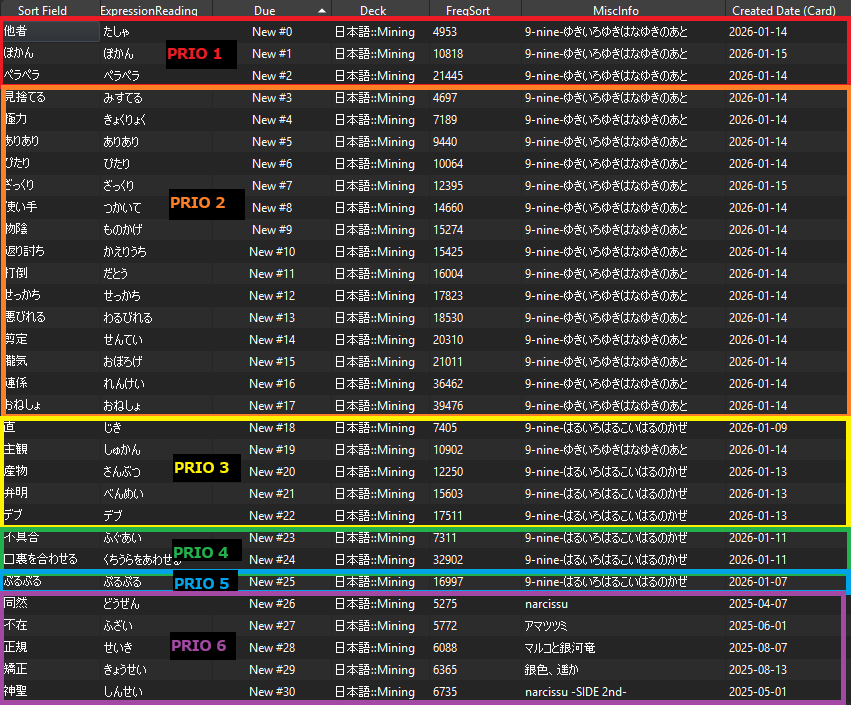

# Priority Reorder Addon

Reorder your Anki cards to prioritize what matters most to you. 

## Overview
This addon ensures you learn the cards you think are most important first. Instead of seeing new cards in just frequency order, you can create a "Priority Queue" based on lots of different criteria:
- **Frequency**: Learn common words before rare ones (using frequency lists).
- **Immersion**: Prioritize words that appear in the VN/Book/Game/Show you are currently/planning on enjoying (using occurrence dictionaries).
- **Recency**: Learn cards you added recently rather than older cards.
- **Kanji**: Prioritize words based on your Kanji knowledge.
- **Content**: Prioritize specific decks, tags, or card types.

<details>
  <summary>View Example</summary>
  <br>
  

  <details>
    <summary>View My Config</summary>
    <br>
  
    ```json
    {
      "normal_prioritization": null,
      "normal_search": "deck:日本語::Mining",
      "priority_cutoff": null,
      "priority_limit": null,
      "priority_search": [
        "deck:日本語::Mining occurrences:[9-nine-ここのつここのかここのいろ,9-nine-そらいろそらうたそらのおと,9-nine-はるいろはるこいはるのかぜ,9-nine-ゆきいろゆきはなゆきのあと]>=10",
        "deck:日本語::Mining occurrences:[9-nine-ここのつここのかここのいろ,9-nine-そらいろそらうたそらのおと,9-nine-はるいろはるこいはるのかぜ,9-nine-ゆきいろゆきはなゆきのあと]>=3",
        "deck:日本語::Mining occurrences:この世の果てで恋を唄う少女YU-NO>=3 added:14",
        "deck:日本語::Mining occurrences:穢翼のユースティア>=10 added:14",
        "deck:日本語::Mining occurrences:魔法少女ノ魔女裁判>=10 added:14",
        "deck:日本語::Mining occurrences:[うたわれるもの,うたわれるもの2,うたわれるもの3]>=20 added:14",
        "deck:日本語::Mining kanji:new=1 added:2 occurrences:[この世の果てで恋を唄う少女YU-NO,穢翼のユースティア]>=5",
        "deck:日本語::Mining occurrences:この世の果てで恋を唄う少女YU-NO>=7",
        "deck:日本語::Mining occurrences:この世の果てで恋を唄う少女YU-NO>=5"
      ],
      "priority_search_mode": "sequential",
      "reorder_before_sync": true,
      "search_fields": {
        "expression_field": "Expression",
        "expression_reading_field": "ExpressionReading"
      },
      "shift_existing": true,
      "sort_field": "FreqSort",
      "sort_reverse": false
    }
    ```
  </details>

  As you can see, my current setup has several priority queues. I generally focus on my highest priorities being focused on frequent words from VN I'm currently reading. Later priority queues are more frequent cards in future VNs I want to read by the frequent cards.
</details>


## Installation
1. Install from [AnkiWeb](https://ankiweb.net/shared/info/857040600).
2. Restart Anki.

> This addon requires you to use a notetype with frequency data to function. I recommend [Lapis](https://github.com/donkuri/lapis) if you need one. If you need to backfill frequency data into existing cards, check out [backfill-anki-yomitan](https://github.com/Manhhao/backfill-anki-yomitan).

## Quick Start
By default, the addon ships with a default config that prioritizes cards added in the last 3 days, but you will need to customize it to your own deck and needs. To edit the config, follow these steps:

1. Go to **Tools** -> **Add-ons** -> **Priority Reorder** -> **Config**.
2. Edit your config (let's say you want to prioritize cards added in the last 5 days instead):
   ```json
   {
        "priority_search": [
            "deck:日本語::Mining added:5"
        ],
        "normal_search": "deck:日本語::Mining",
        "sort_field": "FreqSort",
        "sort_reverse": false
   }
   ```
   > Note: If you have spaces in deck names or occurrence dictionary folder names, you will need to escape them like `"\"deck:日本語::Mining Deck\" added:5"`.
3. Change `"FreqSort"` to the actual name of the sort field in your note type (e.g., `"FreqSort"`, `"Frequency"`).
4. Press **OK**. 
5. The addon will automatically reorder your new cards **after** each sync completes. You can also press ``Ctrl+Alt+` `` to reorder manually.

> **Multi-device users**: Reordering runs *after* sync, so your desktop will always have fresh ordering. If you review on your phone, keep this in mind and either run a manual reorder (``Ctrl+Alt+` ``) before syncing or sync a second time to ensure your phone has the updated order.

## How it Works
The addon splits your **New Cards** into two groups:
1.  **Priority Queue**: Cards matching your `priority_search`. These will be shown *first*.
2.  **Normal Queue**: Cards matching your `normal_search`. These will be shown *after* the priority cards.

Both queues are sorted internally by your `sort_field`. If there are duplicates, those in the highest priority queue matching the card will take precedence. So in the example above, cards added in the last 3 days will be shown first and then even though those cards are also in the normal queue, the priority queue will have already scheduled them first.

## Features Guide
The addon supports several custom filters that you can mix in with standard Anki searches:
- **`f<10000`**: Filter by the value in your frequency sort field.
- **`occurrences:DictionaryName>5`**: Filter by word occurrences in a dictionary.
- **`limit=20`**: Limit the number of results from a specific search.
- **`kanji:num=1`**: Filter by the total number of Kanji.
- **`kanji:new=1`**: Filter by the number of unknown Kanji.

### 1. Frequency Sorting (`f`)
You can prioritize cards based on the numeric value in their sort field. This is most useful in combination with other filters, if you want to prioritize common words in an occurrence search for example.
- **Syntax**: `f<10000` or `f>=30000`. Supports all comparison operators: `=`, `!=`, `<`, `<=`, `>`, `>=`.

### 2. Occurrence Mining (`occurrences:`)
Prioritize words found in specific media (requires Yomitan dictionaries).
- **Syntax**: `occurrences:DictionaryName>=5` or `occurrences:[Dict1,Dict2]>=5`
- **Example**: `occurrences:銀色、遥か>=5` matches cards where the word appears 5 or more times in `銀色、遥か`.
- **Combined**: `occurrences:[銀色、遥か,この世の果てで恋を唄う少女YU-NO]>=10` matches cards where the combined frequency across both dictionaries is 10 or more.

#### Setup for Occurrence Dictionaries
> To use occurrence searching, you need Yomitan occurrence dictionaries. I highly recommend downloading them from [Jiten](https://jiten.moe/). They offer occurrence dictionaries for any media they have cataloged under `Download deck -> Yomitan (occurrences)` on each media page.

1. Go to **Tools** -> **Add-ons** -> **Priority Reorder** -> **View Files**.
2. Open the `user_files` folder.
3. Create a folder for your dictionary (e.g., `銀色、遥か`).
4. Inside that folder, place your `term_meta_bank_1.json` file (exported from [Jiten](https://jiten.moe/)), so that your folder structure looks like this:
   ```
   user_files/
   ├── 銀色、遥か/
   │   └── term_meta_bank_1.json
   └── この世の果てで恋を唄う少女YU-NO/
       └── term_meta_bank_1.json
   ```
5. In your config, set `search_fields` to match your note type, which for [Lapis](https://github.com/donkuri/lapis) would be:
   ```json
   "search_fields": {
       "expression_field": "Expression",
       "expression_reading_field": "ExpressionReading"
   }
   ```
   
### 3. Kanji Prioritization (`kanji:`)
Prioritize words based on your existing Kanji knowledge (scanned from your Review cards).
- **`kanji:new=0`**: Matches words where you *already know* all the characters.
- **`kanji:new=1`**: Matches words with exactly 1 unknown character.
- **`kanji:new>=2`**: Matches words with 2 or more unknown characters.
- **`kanji:num=1`**: Matches words with exactly 1 Kanji.
- **`kanji:num>=3`**: Matches words with 3 or more Kanji.

### 4. Multiple Priorities
Match multiple unrelated criteria by using a list.
- **Sequential**: First match `added:3`, THEN match `tag:ノベルゲーム::銀色、遥か`.
- **Mix**: Match `added:3` OR `tag:ノベルゲーム::銀色、遥か` and sort them all together.

### 5. Limits and Cutoffs
- **`limit=X`**: Use in a search string to take only the top X cards.
  - Example: `added:3 limit=20` (Only the top 20 most frequent recent cards).
- **`priority_limit`**: Global limit for the priority queue.
- **`priority_cutoff`**: Send high-frequency words back to the normal queue even if they matched priority.
