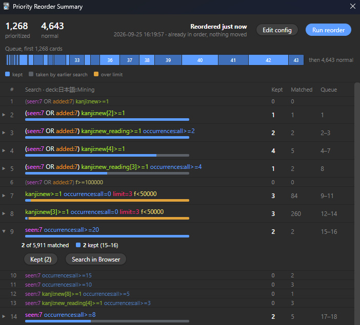

# Priority Reorder Addon

Reorder your Anki cards to prioritize what matters most to you.

## Overview
This addon ensures you learn the cards you think are most important first. Instead of seeing new cards in just frequency order, you can create a "Priority Queue" based on lots of different criteria:
- **Frequency**: Learn common words before rare ones (using frequency lists).
- **Immersion**: Prioritize words that appear in the VN/Book/Game/Show you are currently/planning on enjoying (using occurrence dictionaries).
- **Recency**: Learn cards you added recently rather than older cards.
- **Kanji**: Prioritize words based on your Kanji knowledge.
- **Content**: Prioritize specific decks, tags, or card types.

<details>
  <summary>View Example</summary>
  <br>
  

  <details>
    <summary>View My Config</summary>
    <br>

    ```
    {
      "normal_search": "deck:日本語::Mining",
      "priority_search": [
        "deck:日本語::Mining occurrences:[9-nine-ここのつここのかここのいろ,9-nine-そらいろそらうたそらのおと,9-nine-はるいろはるこいはるのかぜ,9-nine-ゆきいろゆきはなゆきのあと]>=10",
        "deck:日本語::Mining occurrences:[9-nine-ここのつここのかここのいろ,9-nine-そらいろそらうたそらのおと,9-nine-はるいろはるこいはるのかぜ,9-nine-ゆきいろゆきはなゆきのあと]>=3",
        "deck:日本語::Mining occurrences:穢翼のユースティア>=3 added:14",
        "deck:日本語::Mining occurrences:穢翼のユースティア>=10 added:14",
        "deck:日本語::Mining occurrences:魔法少女ノ魔女裁判>=10 added:14",
        "deck:日本語::Mining occurrences:[うたわれるもの,うたわれるもの2,うたわれるもの3]>=20 added:14",
        "deck:日本語::Mining occurrences:穢翼のユースティア>=7",
        "deck:日本語::Mining occurrences:穢翼のユースティア>=5"
      ],
      "priority_search_mode": "sequential",
      "sort_field": "FreqSort",
      "sort_reverse": false,
      "tuning": {
        "priority_cutoff": null,
        "normal_prioritization": null,
        "priority_limit": null,
        "shift_existing": true
      },
      "sync_behavior": {
        "reorder_on_sync": true,
        "auto_update_dicts": false
      },
      "word_fields": {
        "expression_field": "Expression",
        "expression_reading_field": "ExpressionReading"
      }
    }
    ```
  </details>

  As you can see, my current setup has several priority queues. I generally focus on my highest priorities being focused on frequent words from VN I'm currently reading. Later priority queues are more frequent cards in future VNs I want to read by the frequent cards.
</details>


## Installation
1. Install from [AnkiWeb](https://ankiweb.net/shared/info/857040600).
2. Restart Anki.

> This addon requires you to use a notetype with frequency data to function. I recommend [Lapis](https://github.com/donkuri/lapis) if you need one. If you need to backfill frequency data into existing cards, check out [backfill-anki-yomitan](https://github.com/Manhhao/backfill-anki-yomitan).

## Quick Start
The addon ships with a default config that prioritizes cards added in the last 3 days, but you'll want to customize it for your own deck. To edit the config:

1. Go to **Tools** -> **Add-ons** -> **Priority Reorder** -> **Config**.
2. Edit your config with the fields you want to update (let's say you want to prioritize cards added in the last 5 days instead):
   ```json
   {
        "priority_search": [
            "deck:日本語::Mining added:5"
        ],
        "normal_search": "deck:日本語::Mining",
        "sort_field": "FreqSort"
   }
   ```
   > Note: If you have spaces in deck names or occurrence dictionary folder names, you will need to escape them like `"\"deck:日本語::Mining Deck\" added:5"`.
3. Change `"FreqSort"` to the actual name of the sort field in your note type (e.g., `"FreqSort"`, `"Frequency"`).
4. Press **OK**.
5. The addon will automatically reorder your new cards **after** each sync completes. You can also press ``Ctrl+Alt+` `` to reorder manually.

> **Config layout**: the searches and sorting above live at the top level; the rest of the options are
> grouped into `matching`, `tuning`, `sync_behavior` and `word_fields` sections. 

> **Multi-device users**: Reordering runs *after* sync, so your desktop will always have fresh ordering. If you review on your phone, keep this in mind and either run a manual reorder (``Ctrl+Alt+` ``) before syncing or sync a second time to ensure your phone has the updated order.

## How it Works
The addon splits your **New Cards** into two groups:
1.  **Priority Queue**: Cards matching your `priority_search`. These will be shown *first*.
2.  **Normal Queue**: Cards matching your `normal_search`. These will be shown *after* the priority cards.

Both queues are sorted internally by your `sort_field`. If a card matches more than one queue, the highest-priority match wins, so in the example above, recently added cards are scheduled by the priority queue first, even though they also match the normal queue.

> All of the addon's actions live under the **Tools** -> **Priority Reorder** submenu: **Reorder Cards** (``Ctrl+Alt+` ``), **Show Summary**, and **Update Jiten Occurrence Dictionaries**.

## Summary Window
Open **Tools** -> **Priority Reorder** -> **Show Summary** to see what each of your priority searches did in the latest reorder of the current session (if you haven't reordered yet, just press **Run reorder now** or sync).

You get one collapsible card per `priority_search` showing how many cards it **matched** vs. **kept** vs. **discarded**, with buttons to open the kept/discarded notes in the Browser. **Edit config** and **Run reorder now** sit at the top so you can tweak and re-check live. Everything is labeled in the window itself.

> In `"mix"` mode, per-search kept/discarded numbers aren't meaningful (all searches are pooled before sorting), so each card shows only its **matched** count.

## Features Guide
The addon supports several custom filters that you can mix in with standard Anki searches:
- **`f<10000`**: Filter by the value in your frequency sort field.
- **`occurrences:DictionaryName>5`**: Filter by word occurrences in a dictionary.
- **`seen:2`**: Filter by words appearing in your recent daily occurrence dictionaries.
- **`length>=3`**: Filter by the character length of the expression.
- **`limit=20`**: Limit the number of results from a specific search.
- **`kanji:num=1`**: Filter by the total number of Kanji.
- **`kanji:new=1`**: Filter by the number of unknown Kanji (optionally `kanji:new[3]=1` to count a Kanji as new until 3 of your learned words contain it).
- **`kanji:new_reading=1`**: Filter by the number of Kanji used here in a *reading* you haven't learned yet.

### 1. Frequency Sorting (`f`)
You can prioritize cards based on the numeric value in their sort field. This is most useful in combination with other filters, if you want to prioritize common words in an occurrence search for example.
- **Syntax**: `f<10000` or `f>=30000`. Supports all comparison operators: `=`, `!=`, `<`, `<=`, `>`, `>=`.

### 2. Occurrence Mining (`occurrences:`)
Prioritize words found in specific media (requires Yomitan dictionaries).
- **Syntax**: `occurrences:DictionaryName>=5` or `occurrences:[Dict1,Dict2]>=5`
- **Example**: `occurrences:銀色、遥か>=5` matches cards where the word appears 5 or more times in `銀色、遥か`.
- **Combined**: `occurrences:[銀色、遥か,穢翼のユースティア]>=10` matches cards where the combined frequency across both dictionaries is 10 or more.
- **All Dictionaries**: `occurrences:all>=10` is a special keyword that combines the occurrence counts from every dictionary in your `user_files` folder. Useful if you want to prioritize words that are common across all of your media.

#### Setup for Occurrence Dictionaries
> To use occurrence searching, you need Yomitan occurrence dictionaries. I highly recommend downloading them from [Jiten](https://jiten.moe/). They offer occurrence dictionaries for any media they have cataloged under `Download deck -> Yomitan (occurrences)` on each media page.

1. Go to **Tools** -> **Add-ons** -> **Priority Reorder** -> **View Files**.
2. Open the `user_files` folder.
3. Create a folder for your dictionary (e.g., `銀色、遥か`).
4. Inside that folder, place your `term_meta_bank_1.json` file (exported from [Jiten](https://jiten.moe/)), so that your folder structure looks like this:
   ```
   user_files/
   ├── 銀色、遥か/
   │   └── term_meta_bank_1.json
   └── 穢翼のユースティア/
       └── term_meta_bank_1.json
   ```
5. In your config, set `word_fields` to match your note type, which for [Lapis](https://github.com/donkuri/lapis) would be:
   ```json
   "word_fields": {
       "expression_field": "Expression",
       "expression_reading_field": "ExpressionReading"
   }
   ```

> The five options below all live in the `matching` section of your config, alongside
> `kana_normalization` and `combine_word_forms`:
> ```json
> "matching": { "prefix_matching": true, "variant_matching": true }
> ```
> They apply anywhere `occurrences:`/`seen:` are resolved, in the reorder and the Browse bar alike.

#### Prefix Matching
Set `"prefix_matching": true` in your config to allow a card to match with the counts of longer dictionary entries that start with the card's expression. This is useful when a short word shows up in the dictionary primarily as part of longer compounds.

- **Semantics**: `final_count = exact_count + Σ(counts of dict entries where card.expression is a proper written prefix)`.
- **Example**: With `彫刻` as the card expression in your deck, ocurrence dict entries `彫刻家` (100) and `彫刻品` (30) both start with `彫刻`, so `彫刻`'s effective count becomes `exact + 100 + 30`. A threshold like `occurrences:MyDict>=50` can now pick up `彫刻` even if it only appears as a standalone entry a handful of times.
- **Minimum length**: 2 characters. Single-character cards (e.g. `大`) are never credited via bare prefix matches, since the relationship is considered too loose to be meaningful (`手` would absorb `手紙`/`手術`, where it is just a morpheme, often with a different reading).
- **Single-kanji phrase matching**: as a carve-out from the minimum length, a single-kanji card *with a reading* is credited by **particle-linked entries**: entries of the form `X + particle` optionally followed by more (particles: `を が の に で は も へ と`) whose reading starts with the card's reading followed by that particle. Example: `手を貸す` (てをかす) credits a `手`/`て` card, because the reading confirms `手` is being read て, while `手紙` still contributes nothing and a `手`/`しゅ` card is not credited. The trailing part is optional, so bare adverbial forms count too: `俗に` (ぞくに) credits `俗`/`ぞく`, and `特に` credits `特`/`とく`. You don't need a separate card for the particle form. The reading gate is what keeps this from degenerating into noise: it excludes on'yomi compounds and okurigana verbs like `積もる`.
- **Default**: `false`. Note that enabling this flag increases initial index startup time of the addon a bit, but not substantially.

#### Suffix Matching
Set `"suffix_matching": true` in your config to allow a card to match with the counts of longer dictionary entries that *end* with the card's expression, the mirror of prefix matching. Because Japanese compounds are **head-final**, this aggregates a head morpheme with its whole family.

- **Semantics**: `final_count = exact_count + Σ(counts of dict entries where card.expression is a proper written suffix)`. Example: a `学校` card picks up `小学校`/`中学校`/`高等学校`.
- **Gate, ≥ 2 characters and contains a kanji**: this is the set of *real words*, i.e. 2+ kanji terms (`学校`, `目的`) and single-kanji-plus-okurigana words (`食べる`, `見る`, `強い`), which carry their reading and meaning across compounds. So head-final **compound verbs and adjectives** work too: `出す` picks up `思い出す`/`飛び出す`, `強い` picks up `心強い`/`力強い`. **Bare single kanji are excluded** from this path (`語`/`日`/`手` would absorb their whole compound family with unstable reading/meaning), as are pure-kana cards (`する`/`こと`/`しい`, katakana loanwords). It is the tail mirror of prefix matching's minimum-length rule.
- **Single-kanji tail phrases**: as the mirror of prefix matching's single-kanji carve-out, a single-kanji card is credited only by **reading-validated tail particle phrases**: entries of the form `word + particle + X` (particles: `を が の に で は も へ と`) whose reading ends with that particle + the card's reading. Example: `母の日` (ははのひ) credits a `日`/`ひ` card because the phrase reading confirms `日` is read ひ, while `今日`/きょう and `日本語` contribute nothing and a `日`/`にち` card is not credited. Particles sit on a word boundary (no rendaku), so this match is exact and high-precision.
- **Default**: `false`. Composes additively with the other options (and avoids double-counting `お/ご/御` entries when `honorific_folding` is also on); adds a little to index startup time, like prefix matching.

#### Variant Matching
Set `"variant_matching": true` in your config to credit a card with the counts of dictionary entries that are *another written form of the same word*: a different okurigana spelling, or an alternate kanji spelling. Prefix and suffix matching structurally cannot reach these: `煌く` is neither a prefix nor a suffix of `煌めく`.

- **Semantics**: an entry counts when its reading is *identical* to the card's **and** the two forms' kanji **nest**, meaning every kanji of one appears in the other, with at least one kanji on each side. `final_count = exact_count + Σ(counts of those entries)`.
- **Example**: a `煌めく` card picks up `煌く`, but not `燦めく` (no shared kanji) or `きらめく` (no kanji at all). Okurigana families fold together: `落葉`/`落ち葉`, `気持`/`気持ち`, `子供`/`子ども`.
- **Why nesting and not just one shared kanji**: same-reading homophones usually *do* share a kanji but are different words. Nesting rejects `科学`←`化学`, `保証`←`保障`, `対象`←`対照`.
- **Kana spellings are excluded**, because a kana-only entry has no kanji to share. Enable `combine_word_forms` alongside this if you want those credited too. Entries carrying no reading never match, since the rule identifies a word by its reading.
- **Default**: `false`. Composes with the other options without double-counting an entry that prefix/suffix matching already credited. Costs nothing while off; when on, each dictionary pays a one-time index build on first use.

#### Stem Matching
Set `"stem_matching": true` in your config to credit a dictionary-form card with the counts of its **conjugated noun form**: the 連用形 (masu-stem) for verbs, and the `さ`/`み`/`げ` nominalizations for い-adjectives. Occurrence dictionaries list these as separate entries, so a `戒める` card scores zero against a deck that only contains `戒め`.

- **Semantics**: the card's final kana is edited and the result must match a dict entry on **both** expression and reading. Ichidan verbs drop `る` (`戒める`→`戒め`), godan verbs shift the う-row kana to its い-row counterpart (`遊ぶ`→`遊び`, `待つ`→`待ち`, `話す`→`話し`, `泳ぐ`→`泳ぎ`). い-adjectives take all three nominalizers (`強い`→`強さ`/`強み`/`強げ`).
- **No dictionary needed**: the conjugation class is not looked up. Both the ichidan and godan candidates are generated and the *reading* arbitrates, so `起きる` finds `起き` and `走る` finds `走り` while the wrong-class candidate simply matches nothing.
- **Forward only**: a `戒め` card is **not** credited by a `戒める` entry. That direction inverts priority ordering, since a rare derived form inherits the count of a much commoner base word (`無げ`, seen once, would absorb `無い`'s thousands). Enable `matching.prefix_matching` if you want it anyway.
- **Gates**: expression and reading must end in the **same kana** (that is what makes the tail okurigana, and a kanji-final card like `学校` never qualifies); they must **differ from each other**, so a kana-only card cannot validate a match and `それる` will not absorb the pronoun `それ`; and the derived form must be **≥ 2 characters**, which skips both `見る`→`見` and the noun blowups like `神る`→`神`.
- **Not covered**: `する` is irregular, so `勉強する` does not reach `勉強し` (it would produce `勉強す`, which matches nothing). `じる`/`ずる` verbs do work (`感じる`→`感じ`) because they inflect as ichidan.
- **Known imprecision**: a card ending in `る` that is really a past-tense form is caught (`来たる`←`来た`), and a 連用形 noun ending in `い` is treated as an adjective (`囲い`←`囲み`). Measured across 13 dictionaries these were 2 cases in 917 matches.
- **Default**: `false`. Costs nothing while off, and unlike the other options builds **no index at all**. It reads the exact-match tables directly, so it adds no startup time and no memory.

#### Compound Matching
Set `"compound_matching": true` in your config to credit a dictionary-form card with the counts of entries **built on its stem**. This is where most verb vocabulary actually lives: a dict listing `奮い立つ` says nothing about `奮う` under any other option, because the compound neither starts nor ends with `奮う` and does not share its reading.

- **Semantics**: the same 連用形 and `さ`/`み`/`げ` candidates stem matching derives, taken as a prefix instead of an exact match. `奮う` reaches `奮い立つ`, `取る` reaches `取り消す` and `取り扱い`, `受ける` reaches `受け入れる`, `食べる` reaches `食べ物`, `間違う` reaches `間違いない`/`間違いなく`.
- **Both sides must match**: the entry starts with the stem's written form *and* its reading. That is what keeps `抱く`/いだく off `抱きしめる`/だきしめる while `抱く`/だく takes it.
- **Standalone**: this option also covers the exact stem, so it works on its own. Run it with `stem_matching` and the shared entry is counted once.
- **No overlap with prefix matching**: entries starting with the card as written (`食べる`←`食べるもの`) stay with `prefix_matching` whether or not it is on, so turning this on never smuggles in prefix behavior.
- **How loose it is**: measured across 12 dictionaries, 942 of 9,877 eligible entries gained something, a median of +9 counts. The gains are real compounds, but the rule cannot tell a compound from a relative: transitive pairs cross over (`見回る`←`見回す`, `起こる`←`起こす`), drifted idioms ride along (`当たる`←`当たり前`), and a rare base form can inherit a common word's count (`生く`/いく, seen twice, absorbs `生きる`'s compounds). Kana-only cards are excluded by the same gate stem matching uses, so loanwords are safe.
- **Default**: `false`. Costs nothing while off; when on, each dictionary sorts its entry keys once on first use.

#### Honorific Folding
Set `"honorific_folding": true` in your config to credit bare-form cards with the counts of dictionary entries that start with an honorific morpheme (`お`, `ご`, `御`) and whose stripped remainder is the same word. Useful when you want counts for `お茶` or `御社` to also be attributed to the bare forms.

- **Semantics**: a dict entry `お{X}` aliases its count onto `{X}` when `{X}` **contains a kanji** (near-certainly the same lexeme: `お茶の間` → `茶の間`, `お金` → `金`) or is itself an entry in the same dict. Kana-only remainders still require that dict entry, which blocks unrelated-word junk like `おかず → かず` or `おはよう → はよう`. Direction is dict-side only: a card for `お茶` is unchanged, but a card for `茶` picks up `お茶`'s count.
- **Example**: With dict entries `お茶` (50) and `茶` (10), a card for `茶` resolves to `10 + 50 = 60`. A card for `お茶` resolves to 50, unchanged. With only `お茶の間` (9) in the dict, a card for `茶の間` resolves to 9.
- **False-positive note**: a kanji-bearing remainder is folded even when it is a different word or reading than the honorific form (e.g. a `飯`/`めし` card picks up `ご飯`/`ごはん` counts). In practice this only means such a card can cross an occurrence threshold a bit earlier, since counts only ever increase.
- **Default**: `false`.

#### Updating Occurrence Dictionaries
If your occurrence dictionaries were downloaded from [Jiten](https://jiten.moe/), the addon can keep them up to date automatically or on demand.

- **Manual Update**: Go to **Tools** -> **Priority Reorder** -> **Update Jiten Occurrence Dictionaries** to force-check all dictionaries for updates.
- **Auto Update**: Set `"auto_update_dicts": true` inside the `sync_behavior` section of your config to automatically attempt to update dictionaries once per day after syncing.

> **⚠️ Many dictionaries**: Jiten's API allows roughly 10 requests per minute, so with more than 10 dictionaries updates slow down while the addon waits out the limit. If that delay on sync bothers you, prefer the manual update option over `sync_behavior.auto_update_dicts`.

### 3. Kanji Prioritization (`kanji:`)
Prioritize words based on your existing Kanji knowledge (scanned from your Review cards).
- **`kanji:new=0`**: Matches words where you *already know* all the characters.
- **`kanji:new=1`**: Matches words with exactly 1 unknown character.
- **`kanji:new>=2`**: Matches words with 2 or more unknown characters.
- **`kanji:new[3]>=1`**: Matches words with at least 1 Kanji that fewer than 3 of your learned words contain.
- **`kanji:num=1`**: Matches words with exactly 1 Kanji.
- **`kanji:num>=3`**: Matches words with 3 or more Kanji.

By default a Kanji stops counting as *new* as soon as a single learned word contains it. Add a
bracketed target to raise that bar: with `kanji:new[T]`, a Kanji counts as new until **T** of your
learned words contain it (`kanji:new` is equivalent to `kanji:new[1]`). Useful when you want to
keep reinforcing Kanji you've technically "met" but only know from one or two words. The target
applies to `new` and `new_reading`; `kanji:num` takes no bracket.

#### New Readings (`kanji:new_reading`)
`kanji:new` asks whether you've met the *character*. `kanji:new_reading` asks whether you've met
**the reading it takes in this word**, which is what the card actually tests.

Once you've learned 食事 (しょく**じ**), the word 食べる (**た**べる) looks completely known to
`kanji:new`, even though 食=た is new to you. That's the card you're about to fail.

- **`kanji:new_reading>=1`**: Matches words containing at least 1 Kanji whose reading here is new.
- **`kanji:new_reading>=1 kanji:new=0`**: The interesting bucket, i.e. words made *entirely* of Kanji
  you know, in a reading you don't.
- **`kanji:new_reading[3]>=1`**: A reading counts as new until 3 of your learned words use it.

A reading is tracked per Kanji, so 生活 (**せい**かつ) does not help with 生きる (**い**きる).
Inflections of one reading count as the same reading, so 上がる and 上げる are both 上=あ, while
上る (のぼる) is different. Rendaku doesn't create a new reading either: 血 (**ち**) covers
鼻血 (はな**ぢ**).

Words whose reading doesn't attach to the individual Kanji at all, such as 火傷 (やけど), 今日 (きょう),
and gikun readings, count as new for every Kanji they can't explain, which is usually what you
want: those readings are the least predictable ones. Where only part of a word is irregular, only
that part counts (眼鏡/めがね credits 眼=め and flags only 鏡).

> **This filter needs your reading field.** Set `word_fields.expression_reading_field` to the
> field holding the kana reading. Cards without a reading are never matched. Readings are resolved
> against a bundled table derived from [KANJIDIC2](https://www.edrdg.org/wiki/index.php/KANJIDIC_Project).

##### Example
```
occurrences:銀色、遥か>=5 kanji:new=0 kanji:new_reading>=1
```
Common in the visual novel you're reading, looks fully known, and will actually trip you up.

### 4. Recently Seen Words (`seen:`)
> ⚠️ **Experimental**: `seen:` is a newer feature and may change or be removed in a future version.

Prioritize words you've encountered recently in your immersion, using *daily* occurrence dictionaries. It's resolved through this addon, so the `matching` options above (`prefix_matching`, `variant_matching`, `stem_matching`, `compound_matching`, `kana_normalization`, etc.) apply to `seen:` too.
- **Syntax**: `seen:N` matches words appearing in any of the last **N** daily dictionaries. It's boolean, meaning "seen at all" regardless of how many times. A leading `-` negates (`-seen:30`).
- **Examples**: `seen:1` (today), `seen:7` (appeared in any of the last 7 days).
- **Day boundaries**: "today" honors Anki's rollover hour ("Next day starts at" setting).
- **⚡ Keep windows small**: cost grows with # of days, so **the smaller your window, the faster the reorder**. `seen:1`–`seen:3` are cheap, while large windows (`seen:30`+) get noticeably slower, especially with settings like `prefix_matching` or `variant_matching` on. If you care at all about sorting speed, use the smallest window that still means "recently seen". (Reusing the *same* window across several priority searches is free within a reorder.)

#### Setup for Seen Dictionaries
I have additionally created a new [Daily Occurrences addon](https://github.com/tomahtoes/daily-occurrences) that will create seen dictionaries for you per day so long as the text is coming in through a websocket, as is often the case for VN based workflows.

If you wish to develop your own method of building these, place your daily occurrence dictionaries in a reserved `_seen` folder under `user_files`, one subfolder per day named `YYYY-MM-DD`:
```
user_files/
└── _seen/
    ├── 2026-06-11/
    │   └── term_meta_bank_1.json
    └── 2026-06-12/
        └── term_meta_bank_1.json
```
Each `term_meta_bank_*.json` is an ordinary Yomitan occurrence dictionary, the same format as occurrence mining above, and it reuses the same `word_fields` note-type config. The `_seen` folder is **reserved** (the leading underscore keeps it distinct from your real dictionaries): it's never treated as a normal occurrence dictionary, so it's excluded from `occurrences:all` and can't be reached via `occurrences:_seen`. Only `seen:N` reads it.

### 5. Expression Length (`length`)
Filter by the character length of the card's expression field.
- **Syntax**: `length>=3` (3 characters or longer), `length=1` (single-character words). Supports all comparison operators: `=`, `!=`, `<`, `<=`, `>`, `>=`.
- **Counting**: the raw field value is measured in Unicode characters, with no HTML stripping or normalization, so any markup in the field counts toward the length. An empty expression counts as length 0.

### 6. Multiple Priorities
Match multiple unrelated criteria by using a list.
- **Sequential**: First match `added:3`, THEN match `tag:ノベルゲーム::銀色、遥か`.
- **Mix**: Match `added:3` OR `tag:ノベルゲーム::銀色、遥か` and sort them all together.

### 7. Limits and Cutoffs
- **`limit=X`**: Use in a search string to take only the top X cards.
  - Example: `added:3 limit=20` (Only the top 20 most frequent recent cards).
- **`tuning.priority_limit`**: Global limit for the priority queue.
- **`tuning.priority_cutoff`**: Send high-frequency words back to the normal queue even if they matched priority.

## Credits
Kanji reading data is derived from **KANJIDIC2**, Copyright © the
[Electronic Dictionary Research and Development Group](https://www.edrdg.org/wiki/index.php/KANJIDIC_Project),
used under the [CC BY-SA 4.0](https://creativecommons.org/licenses/by-sa/4.0/) licence. The bundled
`kanji_readings.txt` is a modified extract (readings only, re-encoded) and is likewise CC BY-SA 4.0.

## Changelog
See [CHANGELOG.md](CHANGELOG.md) for a dated history of major releases.
